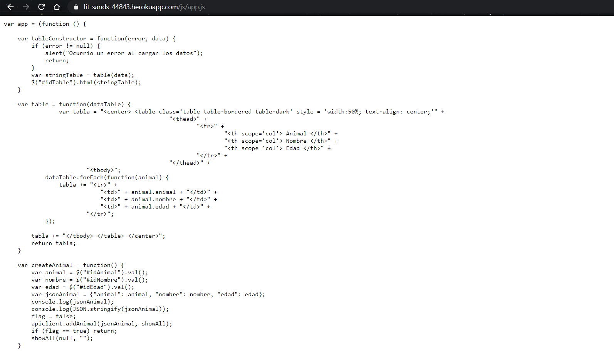

# AREP-LAB3 
 
Este aplicativo simula un servidor web que puede recibir peticiones get y post, así como de algunos archivos como Html, Css, JavaScript, Imagenes.
 
 ## Integración Continua
 [](https://circleci.com/gh/JohannPaez/AREP-LAB3)
 
 ## Despliegue
 [Despliegue en Heroku](https://lit-sands-44843.herokuapp.com/)
 
 ## Prerequisitos
 
 Entender sobre peticiones, servidores, sockets y demás, así como el lenguaje JAVA en el que fue realizado este proyecto.
 
 ## Comandos 
  Para compilar y correr las pruebas: ```mvn package```
  
  Para ejecutar y utilizar el programa: ```mvn exec:java -Dexec.mainClass="com.arep.App"```

  Para ejecutar las pruebas: ```mvn test```
  
  Para generar javadoc con maven: ```mvn javadoc:javadoc```
  
  Para generar javadoc de las pruebas: ```mvn javadoc:test-javadoc```
  
  **IMPORTANTE:** Para poder utilizar el aplicativo es necesario compilar primero el proyecto con **mvn package**.
 
 ## Operaciones
 - **GET**: Permite realizar peticiones get definidas por el usuario como (retornar los animales en este caso).
 	- **/animals**: Es la operación encargada de dar todos los animales.
 - **POST**: Permite realizar peticiones post definidas por el usuario como (insertar un nuevo animal).
 	- **/addAnimal**: Es la operación encargada de añadir un nuevo animal.
 - **Archivos Estáticos**:
 	- index.html
	- style.css
	- app.js
	- apiclient.js
	- tierra.jpg
	- universo.jpg

## Intalación 
Si quieres saber como funciona el programa, tienes que seguir los siguientes pasos:
1. Descargar eclipse (última versión) o cualquier editor de JAVA.
2. Abra el proyecto en el editor.
3. Corra el aplicativo y verifique que no tiene errores.
4. Pruebelo y disfrute el servidor web.

## Instalación (Proyecto Maven)
Para tener una mejor experiencia con el programa, es recomendable tener instalado maven en el sistema operativo,
de esta forma se puede visualizar de una mejor manera las pruebas y ejecutarlas desde consola.
Para instalar maven seguimos los siguientes pasos:
1. En eclipse vamos al menu que dice help.
2. Ahí le damos a install new software.
3. Nos abrirá una nueva pestaña, allí le damos donde aparece "add".
4. En "Name" escribimos lo siguiente: M2Eclipse
5. En "Location" escribimos la siguiente dirección: http://download.eclipse.org/technology/m2e/releases
6. Le damos Add, señalamos los plugins que aparecieron.
7. Aceptamos los terminos y condiciones, y se instalará automáticamente.
8. Reiniciamos eclipse y ya está instalado maven en eclipse.

## Pruebas
- index.html


- style.css


- app.js




- tierra.jpg


- apiclient.js


- universo.jpg


## Diagrama de Clases


## ¿Cómo usar el aplicativo?
1. Copie el enlace proporciano por el git del proyecto y clone el repositorio en el directorio de su preferencia.

	- git clone https://github.com/JohannPaez/AREP-TALLERMVNGIT.git
2. Entre a la carpeta **AREP-LAB3**.
3. Compile el proyecto antes de comenzar a utilizar sus funcionalidades.

	- **NOTA:** Recuerde que el proyecto se compila con el comando **mvn package**.
4. Ejecute el aplicativo y verifique en su navegador web localmente escribiendo localhost:36000
		  mvn exec:java -Dexec.mainClass="com.arep.App

## Ejemplos de uso con maven
Para ello nos dirigimos a la carpeta principal del proyecto, dependiendo de lo que queramos hacer.

Si queremos compilar el proyecto y ver que no tiene fallos, utilizamos el comando **mvn package**.

Si queremos ejecutar las pruebas y ver que todo está perfecto, utilizamos el comando **mvn test**.

**NOTA:** El comando **mvn package** compila y ejecuta las pruebas al mismo tiempo.

## Construido 
[Eclipse](https://www.eclipse.org/) Editor de JAVA donde se puede compilar el proyecto. 

[JUnit](https://junit.org/junit5/) Framework para pruebas en JAVA.

## Autor
Johann Sebastian Páez Campos - Trabajo Programación AREP 03/09/2020

## Licencia
Este programa es de uso libre, puede ser usado por cualquier persona.

